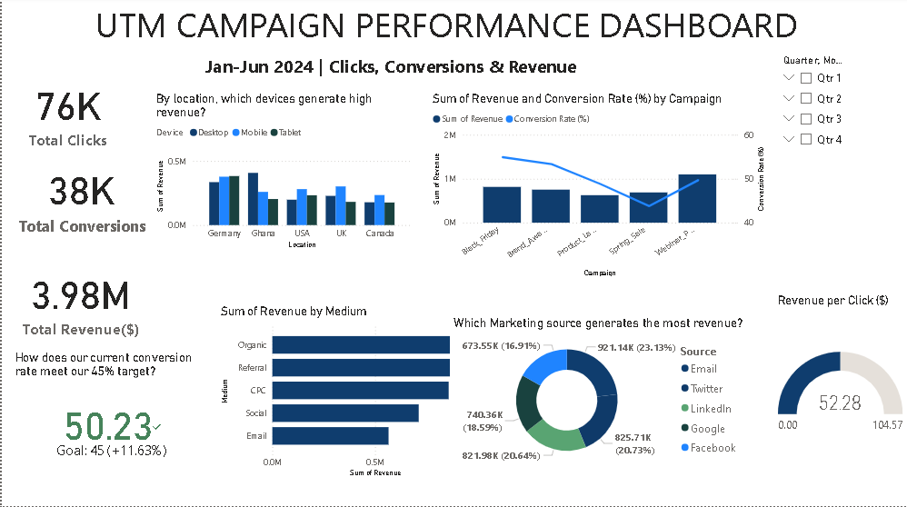
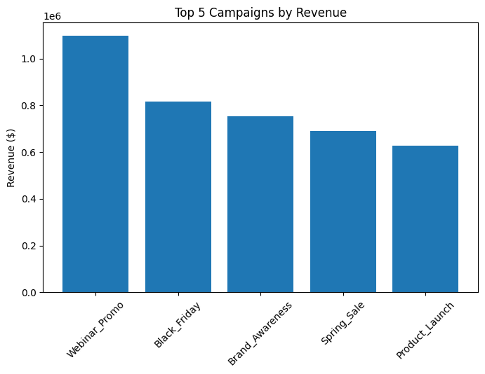
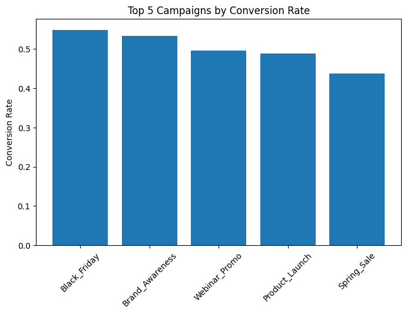
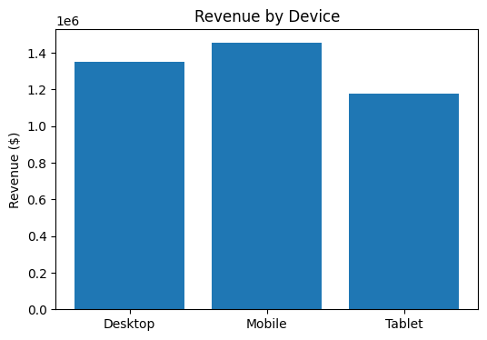
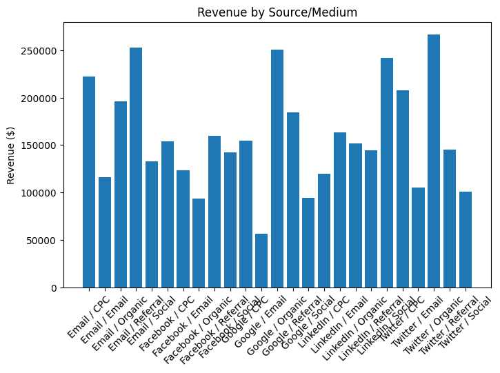
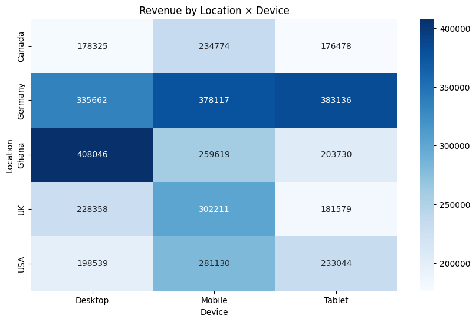

UTM Campaign Analysis Project
📝 Problem Statement

The marketing team is running multiple campaigns across different channels (Black Friday, Webinar Promo, Google, LinkedIn, Facebook, Email, etc.). However, there is no clear visibility into:

Which campaigns are driving the most revenue

How effectively each campaign is converting clicks into conversions

Whether the company is meeting its conversion rate targets

This project analyzes campaign performance across Python, SQL, and Power BI, giving insights into the best-performing campaigns and opportunities for optimization.

  Executive Summary (Jan–Jun 2024 UTM Campaign Performance)

Campaigns delivered strong results with 76K clicks, 38K conversions, and $3.98M in revenue. The conversion rate (50.23%) exceeded the 45% target by 111%, showing efficient performance across channels.

Top Drivers: Webinar campaigns, Google, and LinkedIn delivered the most value.

Underperformers: Email and Facebook consistently lagged, suggesting the need for optimization or reduced investment.

Efficiency: On average, each click generated $52.98 in revenue, confirming high-quality traffic and strong ROI potential.

  Campaign Highlights

Black Friday: Strong efficiency with a 54.9% conversion rate (target: 35%). Revenue growth was driven by Webinar and Google, though clicks and conversions were modest. Potential for scaling.

Webinar Promo: Traffic and revenue improved, but conversion rate dipped slightly to 49.7% (still above target). Google was the main revenue driver, with Twitter and LinkedIn strengthening. Efficiency slipped, showing that scaling attracted some lower-quality traffic.

  Pre-Analysis Questions

Which campaign generated the highest revenue?

Which campaign had the best conversion rate?

Are we meeting our conversion rate target (20–45%)?

How does revenue compare to conversion rate across campaigns?

Which sources (email, social, search) brought in the most valuable traffic?

🛠 Tools & Workflow

Python (Pandas, Matplotlib) → Data cleaning & exploratory analysis

SQL (MySQL Workbench) → Querying campaign performance metrics

Power BI → Dashboard design, KPI tracking, and visualization

Dataset Information

This analysis uses anonymized UTM campaign data collected between January–June 2024.
The dataset was structured from UTM campaign tracking logs, containing:

Campaign – marketing campaign name (e.g., Black Friday, Webinar_Promo)

Source – traffic source (Google, LinkedIn, Email, etc.)

Clicks – number of ad/UTM link clicks

Conversions – number of successful conversions

Revenue – dollar value generated from the campaign

Currency – standardized to USD

  Python Analysis

We started with Python for data cleaning, KPIs, and exploratory charts.

Key Steps in Python:

Imported and cleaned the dataset

Calculated overall KPIs (total clicks, conversions, revenue, conversion rate)

Grouped by campaign and source to analyze performance

Visualized trends using bar charts and line plots

Sample Python Charts (saved as images):

Campaign revenue distribution

Conversion rate by campaign

Revenue vs. Clicks trend

  SQL Analysis

We used MySQL Workbench for deeper querying of campaign performance.

Example SQL Queries:
Total revenue per campaign:
SELECT campaign, SUM(revenue) AS total_revenue
FROM utm_campaigns
GROUP BY campaign
ORDER BY total_revenue DESC;

Conversion rate by campaign:
SELECT campaign,
       SUM(conversions) / SUM(clicks) * 100 AS conversion_rate
FROM utm_campaigns
GROUP BY campaign;

Power BI Dashboard

Finally, we built an interactive dashboard in Power BI to track performance.

### 1. Preview of Dashboard

Key Dashboard Features:

KPIs: Total clicks, conversions, revenue, conversion rate vs. target

Donut Chart: Revenue by campaign

Line & Clustered Column Chart: Compare revenue and conversion rate per campaign

KPI Visuals with Targets: Track whether campaigns met conversion goals

Filters: Campaign and source drilldowns

Business Questions addressed in Power BI:

Which campaigns bring the most revenue?

Which campaigns are most efficient (conversion rate)?

Are we achieving the conversion target (20–45%)?

Should we scale up or scale down any campaign?

📌 Final Insights & Recommendations

Scale Up: Webinar and Google campaigns — high revenue + strong conversion efficiency.

Optimize or Reduce: Email and Facebook — underperforming with low ROI.

Maintain Efficiency: Black Friday campaign shows potential for scaling.

Monitor Conversion Quality: Scaling campaigns (like Webinar Promo) may bring lower-quality traffic, so quality checks are needed.

Set Targets: Conversion rate target of 20–35% is realistic, but top campaigns can go beyond 50%.

 Visualizations From Python Analysis
## 📊 Visualizations  

### 1. Top 5 Campaigns by Revenue  
  

### 2. Top 5 Campaigns by Conversion Rate  
  

### 3. Device Performance  
  

### 4. Source/Medium Performance  
  

### 5. Location × Device Heatmap  
  

